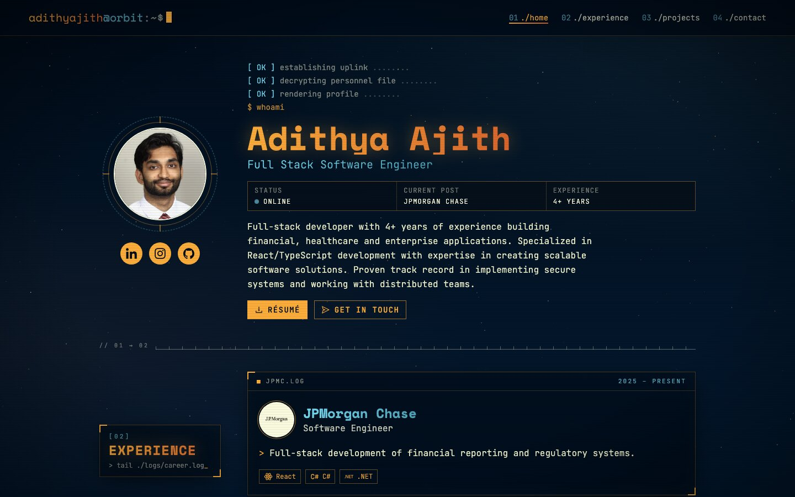
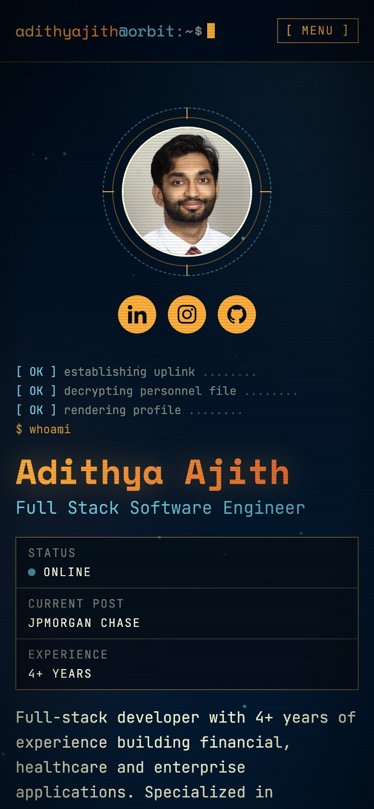

# adifolio

Personal portfolio site for Adithya Ajith, a full-stack software engineer: [adithyajith.com](https://www.adithyajith.com).

It's a single page with four sections (Home, Experience, Projects, Contact), styled as a sci-fi mission terminal. There's a drifting starfield, terminal-window panels with HUD corner brackets, and monospace type, all in the site's original colors: deep navy, cream, amber/ember and cyan.

<p>
  
  
</p>

## Stack

- [React 18](https://react.dev) + TypeScript
- [Vite 6](https://vite.dev)
- [Tailwind CSS 4](https://tailwindcss.com) (via `@tailwindcss/vite`), with theme tokens defined in `src/index.css`
- [react-icons](https://react-icons.github.io/react-icons/) for tech and UI icons
- JetBrains Mono (body) and Space Mono (display) from Google Fonts

## Getting started

```sh
npm install
npm run dev       # start the dev server with HMR
npm run build     # type-check and build to dist/
npm run preview   # serve the production build locally
npm run lint      # ESLint
```

## Project structure

```
docs/                README screenshots (not deployed)
public/              headshot, company logos, project screenshots (WebP), favicon, résumé PDF
src/
  data.ts            all site content: profile, socials, jobs, projects
  App.tsx            page layout: starfield, CRT overlay, navbar, sections, footer
  index.css          theme tokens, panel/ruler/CRT styles, scrollbars, reduced-motion rules
  components/
    Starfield.tsx    canvas starfield with drift, twinkle and scroll parallax
    Navbar.tsx       terminal-prompt navbar, active-section highlight, mobile menu
    Section.tsx      section shell with the sticky "[02] EXPERIENCE" label
    Panel.tsx        terminal window: title bar plus content
    Work.tsx         experience entry
    Project.tsx      project entry with a scrollable media strip
    YouTubeEmbed.tsx click-to-load YouTube player
    Button.tsx       renders an <a> when given href, otherwise a <button>
    Ruler.tsx        tick-mark separator between sections
    Footer.tsx       status-bar footer
  sections/          Home, Experience, Projects, Contact
```

### Editing content

Everything you'd normally change lives in `src/data.ts`:

- **New job:** add an entry to `jobs`. Pick skills from the `skills` map at the top, or add new ones.
- **New project:** add an entry to `projects`. `media` takes images (`{ kind: 'image', src, alt }`) and YouTube videos (`{ kind: 'youtube', id, title }`).
- **Images:** put them in `public/` as WebP, about 768px tall. Screenshots display 192–256px tall, so that leaves room for retina screens. To convert one:
  `magick in.png -resize 'x768>' -quality 82 out.webp`

### Theme tokens

The colors are Tailwind theme variables in `src/index.css`, so you can use them as classes like `text-amber`, `border-amber/40` or `bg-void`:

| Token   | Hex       | Used for                         |
| ------- | --------- | -------------------------------- |
| `void`  | `#000c1a` | page and panel background        |
| `ink`   | `#f1f3ce` | body text                        |
| `cream` | `#ffffe3` | borders, dim text, stars         |
| `amber` | `#feaf3c` | primary accent, buttons, headers |
| `ember` | `#db662d` | end of the amber gradient        |
| `cyan`  | `#77dbf4` | secondary accent, subheads       |

### Motion

The starfield, boot sequence, blinking cursors and rotating reticle all turn off when the visitor has `prefers-reduced-motion` set. In that case the starfield draws one static frame.

---

## Review notes

### Done in the October 2026 refactor

- **The contact form works.** It's now a real `<form>` with labelled, required fields. On submit it opens the visitor's mail client with the message pre-filled to `adithya@satyaloka.org`, and it also shows the address as a direct link.
- **Buttons are real links and buttons**, so the whole pill is clickable and keyboard-focusable.
- **Accessibility:**
  - Every image has alt text, or `alt=""` if it's decorative.
  - The social links have accessible names.
  - Skill icons now show a visible text label.
  - There's a skip link, amber focus rings, and a keyboard-scrollable media strip.
  - The scrollbar is 8px wide and easier to grab.
- **Mobile navigation:** below the `md` breakpoint there's a `[ menu ]` toggle. It closes on Escape or when you pick a link.
- **Metadata:**
  - There's a custom favicon and a meta description.
  - Open Graph and Twitter tags are set, with `og-headshot.jpg` as the preview image.
  - The page title is now "Adithya Ajith — Software Engineer".
- **Performance:**
  - Screenshots are converted to WebP, which cut them from about 2.9 MB to about 330 KB.
  - Images lazy-load.
  - The YouTube player only loads after a click.
- **Content fixes:**
  - The bio now says "4+ years", matching the experience section.
  - "JPMorgan Chase" is spelled the way the firm writes it.
  - ferox links to "crates.io" and Treeline to "itch.io" instead of a generic "Live Site".
- **Cleanup:**
  - Content moved into `data.ts`.
  - Removed the unused `Separator`, CSS classes, `wave.svg`, spacer divs, and the invalid `h-min-screen`.
  - Removed `w-screen` along with the `overflow-x: hidden` workaround it needed.
  - The font stack now falls back to monospace.

### Still to do

- **Update the résumé PDF.** It still says "2+ years", doesn't list JPMorgan Chase, and its dates differ slightly from the site's (Prohashing is Jan–Dec 2022 there but 2021–2022 on the site; Comcast is 2023 only there but 2022–2023 on the site).
- **Optionally deliver contact messages straight to your inbox.** The `mailto:` approach relies on the visitor having a mail client set up. To receive messages directly, point the form at a service like Formspree or Web3Forms. Only `handleSubmit` in `src/sections/Contact.tsx` needs to change.
- **Make a proper social card.** `og-headshot.jpg` works, but a 1200×630 image in the site's style would look better in link previews. Swap it in `index.html`.
- **Add more substance to each role.** The résumé has strong numbers (for example "50,000+ daily reports, 65% lower latency" at KanTime) that the site's job descriptions don't use yet.
- **Add a "what I learned" line per project.** One line each would make the projects more memorable.
